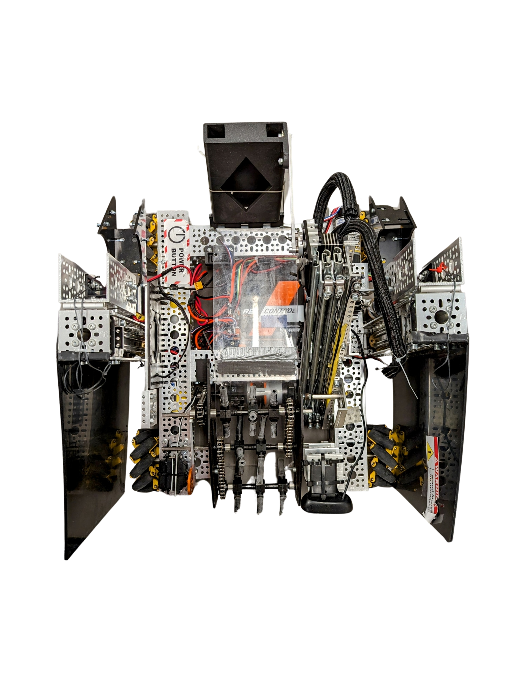

# Centerstage Game (Erick M - solo)

## Objective

The objective of the game is for player's to score more points than their opposing alliance. Each **alliance** consists of **one robot** for each player that will attempt to score in their respective areas in order to beat their opponent in points. Players have a time limit of 2 minutes and 30 seconds to obtain as many points as possible before time runs out.

## Gameplay/Mechanics

The program utilizes various forms of mechanics in order to make the game better and more challenging for the player. The robots are able to **immediately intake pixels** once they are close enough using **collision detection** that checks if the robot's **intake system** has made contact with the **game elements**. In addition, the robots are able to score into their **backdrops** by positioning themselves within the area and pressing **"o"** to output the pixel, obtaining them a point. The robot is unable to **exit the map**, as they will be automatically pushed back in if the player attempts to move the robot out of view. In addition, the robots cannot **collide with each other** because of collision detection through conditional selective algorithms

## Scoring

The players are able to score points by **intaking game elements** known as pixels and dropping them in their respective **alliance backdrops**, when a pixel is intaked, the program reflects this by displaying an **image with their pixel inside the intake system**. When a pixel is taken, the opposing robot is unable to **steal the pixel** thanks to the collision detection mentioned above. When a robot scores a pixel, their score count is updated within the program, and will display a **new coloured pixel** in a different position. Robots are able to freely score in their backdrops until the time runs out, to which the program will no longer display the robots and will show which alliance has won the match.

## Limitations

The program is unable to track the movement of both robots if movement keys are held down. While the program is able to perfectly track the motion of both robots when the keys are pressed, if two keys are held simultaneously, only the first key that is pressed will be taken in by the machine. In addition, the robots are unable to score points in the endgame phase by hanging off of the middle truss as seen in the real centerstage game. 